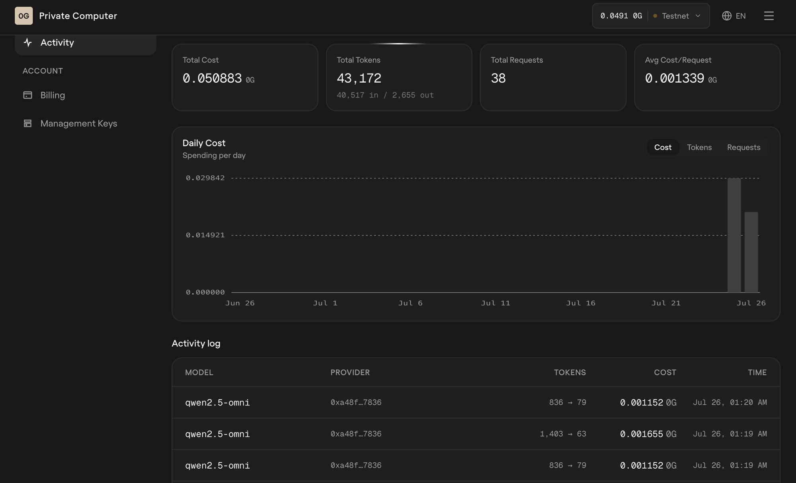

# MilFi

**AI-verified drone kills settle instantly on Hedera, gated by World ID human-backed agents.**

A civilian spotter reports a threat → a 0G-hosted vision agent judges whether it's real → a
defense unit intercepts it → a second 0G agent judges the intercept from post-strike imagery.
Every hash and verdict is written to an immutable Hedera Consensus Service log, and a Hedera
Agent Kit settle-agent reads that log and autonomously transfers DEFPOINT tokens to the unit's
Hedera account — seconds, not months. Before paying, the settle-agent asks World's AgentKit
whether the paying agent is backed by a real, unique, verified human; if not, the payout is
refused. It sits on top of an air-defense coordination map we already run operationally at our
own counter-UAV contracting company in Ukraine.

Full story, architecture, and per-sponsor requirement mapping: [`docs/`](./docs) — start at
[`docs/01-story.md`](./docs/01-story.md).

## Bounty evidence — at a glance

| Sponsor | Requirement | Status | Evidence |
|---|---|---|---|
| Hedera | Autonomous agent payment on Testnet, HashScan link | ✅ Done | [Payment flow](#payment-flow--live-verifiable-on-hedera-testnet) below |
| Hedera | ≥2 native services (HTS/HCS/Mirror Node/Scheduled) | ✅ Done | HTS (DEFPOINT) + HCS (evidence topic) + Mirror Node reads |
| Hedera | Zero Solidity | ✅ Done | `grep -r "\.sol" .` → no hits |
| 0G | Inference actually runs on 0G Compute | ✅ Done | Real router calls, not OpenAI — [0G section](#0g-compute--verification-agents) |
| 0G | TEE-sealed inference | ✅ Done (as of this run) | `OG_API_KEY_TEE` (Private trust mode) now wired as the priority key in `platform/server/src/config.ts` |
| 0G | Proof-of-inference artifact | ✅ Done | Console screenshot + request/trace ids, see below |
| 0G | Agentic ID / contract address | ❌ Not done | No on-chain agent identity minted yet |
| World | AgentKit gates payout, negative case works | ✅ Done | Real `authorize-payout` calls, paid + rejected, see below |
| World | Selfie/Identity Beta feedback doc | ❌ Not done | `docs/world-feedback.md` doesn't exist |
| All | Video (2:00–2:59) | ❌ Not done | Not started |

## Repo layout

- **`platform/`** — pre-existing air-defense coordination map (React + Fastify + MongoDB),
  declared as the pre-hackathon "starter" base per the Start Fresh rule. The Settlement Console,
  ledger panel, 0G verification agents, Hedera journal/settle-agent, and World payout-authorization
  wiring are new — built during the hackathon window. See [`platform/README.md`](./platform/README.md).
- **`verification/`** — standalone 0G Compute vision-inference harness used to prototype Agent A/B
  before they were wired into `platform/server`. See [`verification/README.md`](./verification/README.md).
- **`app/`** — World identity / AgentKit mini-app (Next.js). See [`app/CLAUDE.md`](./app/CLAUDE.md).
- **`docs/`** — story, architecture, integration contract, submission checklist, and planning
  artifacts (AI-tool attribution lives here too — see below).

## Payment flow — live, verifiable on Hedera testnet

The settle-agent is an autonomous loop (Hedera Agent Kit), not an HTTP handler: it reads the
evidence topic via Mirror Node, applies the payout rule, checks World human-backing, and fires
the HTS transfer itself.

Everything below is a **real testnet run**, not a mock — click through and check it yourself:

| What | HashScan link |
|---|---|
| DEFPOINT token (HTS) | https://hashscan.io/testnet/token/0.0.9753000 |
| Evidence journal (HCS topic) | https://hashscan.io/testnet/topic/0.0.9753001 |
| Autonomous payout — engagement `eng-7e26d38e4e` (100 DEFPOINT, no human in the loop) | https://hashscan.io/testnet/transaction/0.0.9713724-1785028775-015957706 |
| Paying unit's account | https://hashscan.io/testnet/account/0.0.9760875 |

Journal entries for that same engagement, in HCS sequence order (topic `0.0.9753001`): report
hash → seq 57, Agent A verdict → seq 58, downing recorded → seq 59, Agent B verdict → seq 60,
payout receipt → seq 61. Each is independently fetchable from the public Mirror Node, e.g.:

```
curl https://testnet.mirrornode.hedera.com/api/v1/topics/0.0.9753001/messages/61
curl https://testnet.mirrornode.hedera.com/api/v1/transactions/0.0.9713724-1785028775-015957706
```

**Negative case (World's required demo moment):** a bot unit with no World identity submits the
same claim → the settle-agent rejects it before any Hedera transfer is attempted ("no human
backing (World)") — no transaction exists for that path because the agent refuses to spend.

## World AgentKit — human-backed payout authorization

Before the settle-agent moves any money, it calls World's `authorize-payout` API (Interface 1 in
[`docs/04-integration-contract.md`](./docs/04-integration-contract.md)) and only pays if the
requesting agent is backed by a real, unique, verified human. This is live — not stubbed:

- **Human-backed unit → authorized → paid:** engagement `eng-658aeb98bf`, World responded
  `{"ok":true,"status":200}`, settle-agent paid 100 DEFPOINT →
  https://hashscan.io/testnet/transaction/0.0.9713724-1785026085-018740608
- **Not human-backed → refused:** engagement `eng-6cd5ba5e58` completed the same World API round
  trip (`{"ok":true,"status":200}` — the call succeeded) but the response denied authorization
  ("no human backing"), so the settle-agent refused the payout — no transaction exists for it.
  This is the required negative case: the check isn't cosmetic, it genuinely gates whether money
  moves.

## 0G Compute — verification agents

Agent A ("is this a threat?") and Agent B ("was it destroyed?") are calls to `qwen2.5-omni`
hosted on 0G Compute's OpenAI-compatible router (`router-api-testnet.integratenetwork.work`),
not OpenAI or a local model. The inference key is 0G's **Private (TEE)** trust mode, so the
model runs inside a hardware enclave the caller can't see into.

Proof-of-inference for the same `eng-7e26d38e4e` run above — input photo, request id, and the
raw verdict, so this is checkable without any 0G console access:

**Agent A** — input: [`verification/fixtures/drone2.jpg`](./verification/fixtures/drone2.jpg)
(report photo) · request id `chatcmpl-a4702bf7-d056-4330-a97a-049edfa82e48`
```json
{ "is_threat": true, "classification": "shahed_class", "objects_seen": ["wreckage"],
  "confidence": 0.95, "reasoning": "The wreckage includes components consistent with Shahed-class drones." }
```

**Agent B** — input: [`verification/fixtures/drone.jpg`](./verification/fixtures/drone.jpg)
(post-strike photo) · request id `chatcmpl-a85cd209-bfdf-4332-aba5-c8573ee71b3f`
```json
{ "destroyed": true, "evidence_type": "wreckage", "consistent_with_prior": false,
  "objects_seen": ["fragment"], "confidence": 0.8,
  "reasoning": "The presence of wreckage suggests destruction, but the label indicates a different type of object than reported by Agent A." }
```

**0G's own request-tracing fields.** The `id: "chatcmpl-..."` above is the OpenAI-compatible field;
0G's router additionally returns its own internal trace object, which is what actually ties a call
to the dashboard below:

```json
"x_0g_trace": {
  "request_id": "eb96b28c-f360-4d35-a901-81e676964031",
  "provider": "0xa48f01287233509FD694a22Bf840225062E67836",
  "billing": { "input_cost": "13000000000000", "output_cost": "12000000000000", "total_cost": "25000000000000" }
}
```

**Console Activity screenshot** — [`docs/evidence/0g-activity-console.png`](./docs/evidence/0g-activity-console.png).
38 real requests, 0.050883 0G total spend, `qwen2.5-omni` via provider `0xa48f…7836` — an exact
match to the `x_0g_trace.provider` address above, directly linking this codebase's calls to this
account's dashboard:



Unlike Hedera, 0G Compute has no public, permissionless explorer for router requests — the
console screenshot + trace ids above are 0G's own accepted proof-of-inference format for this
kind of submission, not a self-serve link a judge can independently query.

**Open item:** no Agentic ID minted yet for Agent A/B (0G's on-chain agent identity, needed for
the "contract deployment address" submission field) — tracked in
[`docs/05-submission-checklist.md`](./docs/05-submission-checklist.md).

## AI-tool attribution

This project was built extensively with **Claude Code** (Anthropic) across all three components:
14 of the repo's 28 commits are Claude-co-authored. Planning artifacts, specs, and prompts used
throughout the build live in [`docs/`](./docs) and `app/.claude/` — included in this repo, not
hidden, per the event's AI-attribution rule.

## Setup

Each component runs independently — see its own README for exact steps:

- Coordination map + settlement backend: [`platform/README.md`](./platform/README.md)
- 0G verification harness: [`verification/README.md`](./verification/README.md)
- World mini-app: `app/my-first-mini-app/README.md`
